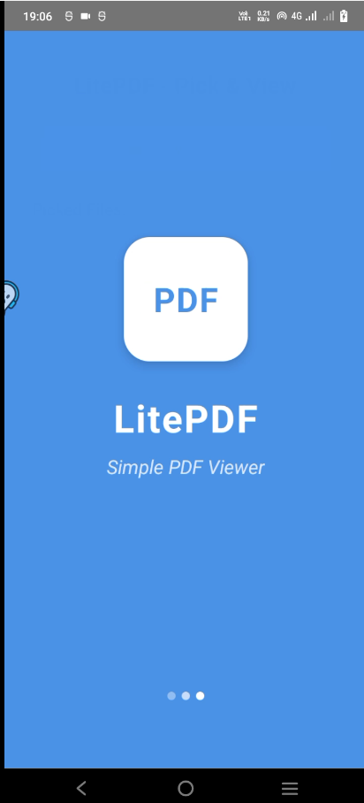
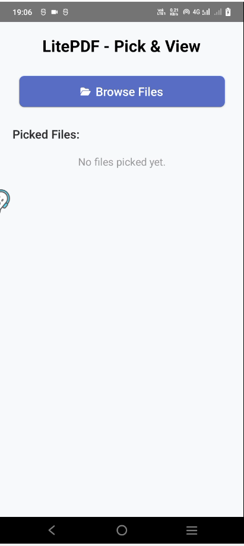
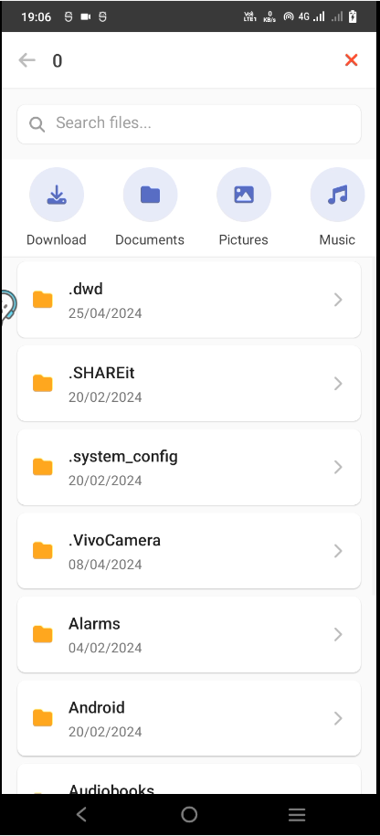
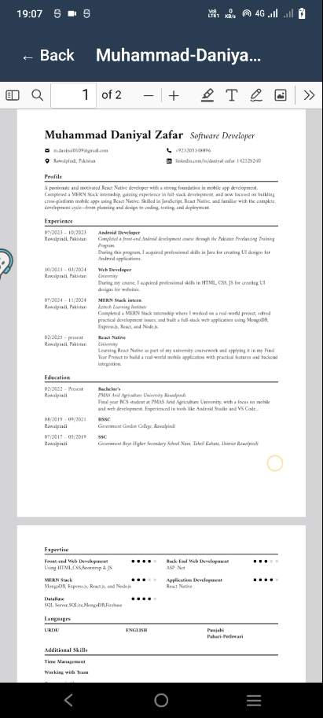

# 📄 LitePDF

**LitePDF** is a modern, lightweight **PDF viewer** built with **React Native**.  
It lets you easily browse, pick, and open PDF files directly from your device storage, with a clean and intuitive user interface using a local **PDF.js** `viewer.html`.

---

## ✨ Features

- 📂 **File Picker**: Browse files and folders, with shortcuts to Downloads, Documents, Pictures, Music, and DCIM.
- 🔍 **Search**: Quickly filter files by name.
- 📑 **PDF Viewer**: Open and read PDF files inside the app using Mozilla’s PDF.js embedded in a local `viewer.html` file.
- 📊 **File Details**: See file size, type, and last modified date.
- 🌙 **Modern UI**: Smooth, material-inspired design with shadows, icons, and responsive layouts.
- ✅ **Offline Support**: Fully functional without internet – works with local device storage.
- 📤 **Share Files** _(optional)_.

---

## 🛠 Built With

- [React Native](https://reactnative.dev/)
- [`react-native-fs`](https://github.com/itinance/react-native-fs) – Access device storage
- [`react-native-webview`](https://github.com/react-native-webview/react-native-webview) – Render the embedded PDF.js `viewer.html`
- [`@fortawesome/react-native-fontawesome`](https://github.com/FortAwesome/react-native-fontawesome) – Beautiful icons
- [`@react-navigation`](https://reactnavigation.org/) – Navigation system
- **[Mozilla PDF.js](https://mozilla.github.io/pdf.js/)** – For rendering PDFs in the local `assets/pdfjs/web/viewer.html`

---

## 🚀 Getting Started

> **Note**: Make sure you have completed the [Set Up Your Environment](https://reactnative.dev/docs/environment-setup) guide before proceeding.

### 📦 1️⃣ Clone & Install

```bash
# Clone this repo
git clone https://github.com/yourusername/LitePDF.git
cd LitePDF

# Install dependencies
npm install
```

### ⚙️ 2️⃣ Start Metro

Run the Metro dev server:

```bash
npm start
# or
yarn start
```

### 📱 3️⃣ Build & Run

With Metro running, open a new terminal:

#### Android
```bash
npm run android
# or
yarn android
```

#### iOS _(optional)_

Make sure CocoaPods are installed:
```bash
cd ios
pod install
```

Then run:
```bash
npm run ios
# or
yarn ios
```

> 🗂️ **Note:** The PDF viewer relies on the local `viewer.html` being placed in:
> ```
> android/app/src/main/assets/pdfjs/web/viewer.html
> ```

---

## 🔄 Modify & Test

Edit your app’s code in `App.tsx` or your screens. When you save, your app updates instantly using [Fast Refresh](https://reactnative.dev/docs/fast-refresh).

- **Reload Android**: `R` key twice in terminal or `Ctrl+M` → Reload.
- **Reload iOS**: `Cmd+R` in Simulator.

---

## 🐞 Troubleshooting

If you run into any setup issues, see:
- [React Native Environment Setup](https://reactnative.dev/docs/environment-setup)
- [Troubleshooting](https://reactnative.dev/docs/troubleshooting)

---

## 📸 Screenshots

_Add your screenshots here!_

| Splash Screen | Home Screen | File Picker | File Picker (Download Folder) | File Viewer | PDF Viewer |
|---------------|-------------|-------------|-------------------------------|-------------|------------|
|  |  |  |.png) | |

---

## 👏 Credits

- Built with React Native & Open Source libraries.
- PDF rendering powered by [Mozilla PDF.js](https://mozilla.github.io/pdf.js/).

---

## 📃 License

This project is open source — feel free to fork & improve!

---

**Enjoy LitePDF!**
